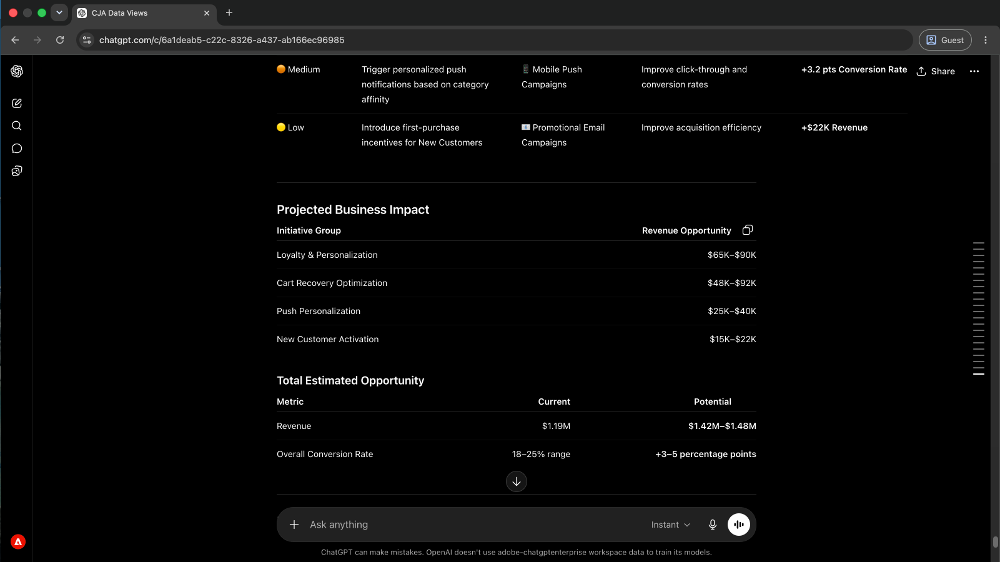

# Outils Adobe CX Enterprise Agentic

<!-- last-modified: 2026-06-08 -->

>[!VIDEO](https://video.tv.adobe.com/v/3491235/?learn=on&enablevpops)

Laissez AI devenir votre collaborateur pour Adobe CX Enterprise. Connectez votre client d’IA à des campagnes, des audiences, des parcours et du contenu. Interagissez avec eux en langage clair à partir de n’importe quel outil que vous utilisez déjà. Pas de nouvelles interfaces, pas de changement de contexte, pas de codage requis pour commencer.

>[!TIP]
>**Commencez avec la passerelle CX Coworker.** Une connexion donne à votre client d’IA l’accès à Adobe Journey Optimizer, Customer Journey Analytics et Real-Time CDP en fonction des licences de votre entreprise. [Se connecter maintenant](tools/mcp-servers.md#cx-coworker-gateway)

<!--
CARDS

* tools/mcp-servers.md
  {title = MCP Servers}
  {description = Connect any MCP-compatible AI client to Adobe CX Enterprise workflows. Query data, analyze campaigns, and access audiences without leaving your AI tool.}
  {cta = Explore MCP Servers}
  {image = assets/mcp-servers-card.png}

* tools/agent-skills.md
  {title = Agent Skills}
  {description = Adobe-curated workflows that guide agents through CX Enterprise tasks. Domain expertise encoded once, applied consistently.}
  {cta = Explore Agent Skills}
  {image = assets/agent-skills-card.png}

* tools/apis.md
  {title = APIs for Builders}
  {description = Build custom Adobe CX Enterprise applications using agentic coding tools like Claude Code and Cursor.}
  {cta = Explore APIs for Builders}
  {image = assets/apis-card.png}
-->
<!-- START CARDS HTML - DO NOT MODIFY BY HAND -->

    

        

            

                <figure class="image x-is-16by9">
                    
                </figure>
            

            

                

                    

                        <a href="tools/mcp-servers.md" title="Serveurs MCP"> Serveurs MCP </a>
                    

                    
Connectez n’importe quel client d’IA compatible MCP aux workflows Adobe CX Enterprise. Interroger des données, analyser des campagnes et accéder à des audiences sans quitter votre outil d’IA.

                

                <a href="tools/mcp-servers.md" class="spectrum-Button spectrum-Button--outline spectrum-Button--primary spectrum-Button--sizeM" style="align-self: flex-start; margin-top: 1rem;">
                    Explorer les serveurs MCP
                
            

        

    

    

        

            

                <figure class="image x-is-16by9">
                    
                </figure>
            

            

                

                    

                        <a href="tools/agent-skills.md" title="Compétences de l’agent">Compétences agent</a>
                    

                    
Workflows traités par Adobe qui guident les agents tout au long des tâches de CX Enterprise. Expertise du domaine encodée une fois, appliquée de manière cohérente.

                

                <a href="tools/agent-skills.md" class="spectrum-Button spectrum-Button--outline spectrum-Button--primary spectrum-Button--sizeM" style="align-self: flex-start; margin-top: 1rem;">
                    Explorer les compétences de l’agent
                
            

        

    

    

        

            

                <figure class="image x-is-16by9">
                    
                </figure>
            

            

                

                    

                        <a href="tools/apis.md" title="API pour les créateurs">API pour Builders</a>
                    

                    
Créez des applications d’entreprise Adobe CX personnalisées à l’aide d’outils de codage agentiques tels que Claude Code et Cursor.

                

                <a href="tools/apis.md" class="spectrum-Button spectrum-Button--outline spectrum-Button--primary spectrum-Button--sizeM" style="align-self: flex-start; margin-top: 1rem;">
                    Explorer les API pour Builders
                
            

        

    

<!-- END CARDS HTML - DO NOT MODIFY BY HAND -->

## Des outils agentiques pour chaque équipe

>[!BEGINTABS]

>[!TAB  Serveurs MCP ]

Utilisez n’importe quel client d’IA compatible pour accéder aux applications CX Enterprise en langage clair. Aucun codage requis. Commencez par la passerelle CX Coworker pour une connexion unique à AJO, CJA et Real-Time CDP, ou connectez-vous directement à AEM et à d’autres applications.

- Connectez-vous en quelques minutes depuis Claude, Cursor, ChatGPT et d&#39;autres clients compatibles avec MCP
- Interrogation des campagnes, des audiences et des données de parcours à l’aide du langage naturel
- Aucune nouvelle interface ou formation requise

[Prise en main des serveurs MCP](tools/mcp-servers.md)

>[!TAB Compétences agent]

Les compétences de l’agent codent l’expertise du domaine Adobe en tant qu’instructions que votre client IA peut suivre. Au lieu d’improviser, l’agent sait exactement ce qu’il doit faire, de manière fiable, répétée et alignée sur les bonnes pratiques Adobe.

- Résultats cohérents pour les workflows CX Entreprise répétables
- Nul besoin d’expliquer Adobe à l’agent : la compétence s’en charge
- Fonctionne sur les clients d’IA qui prennent en charge les compétences des agents

[Explorer les compétences de l’agent](tools/agent-skills.md)

>[!TAB API pour Builders]

Accès direct et par programmation aux mêmes API que celles qui alimentent les produits Adobe. Créez des applications et des intégrations personnalisées qui donnent à votre équipe un accès ciblé et régi à des workflows d’entreprise CX spécifiques.

- Créer une seule fois, déployer dans l’ensemble de l’organisation
- Ajoutez des mécanismes de sécurisation, des approbations et une logique personnalisée dont votre équipe a besoin
- Utilisez le code Claude, le curseur et d&#39;autres outils de codage pour créer plus rapidement

[Explorer les API pour Builders](tools/apis.md)

>[!ENDTABS]

## Outils agentiques en action

Découvrez à quoi ressemblent les outils d’agentic d’Adobe CX Enterprise dans la pratique. Chaque présentation couvre un scénario commercial réel, de la configuration au résultat, montrant exactement comment connecter un client d’IA, ce qu’il faut demander et ce que vous obtenez en retour.

<!--
CARDS

* use-cases/analyze-campaign-performance.md
  {title = Campaign insights without reports}
  {description = Ask performance questions in plain language and get answers from Customer Journey Analytics, without building a single report.}
  {cta = Surface campaign insights}

* use-cases/manage-aem-content.md
  {title = Ship content updates faster}
  {description = Find, update, and publish AEM pages and content fragments faster, without switching to the AEM interface.}
  {cta = Ship content faster}

-->
<!-- START CARDS HTML - DO NOT MODIFY BY HAND -->

    

        

            

                <figure class="image x-is-16by9">
                    
                </figure>
            

            

                

                    

                        <a href="use-cases/analyze-campaign-performance.md" title="Informations sur la campagne sans rapports">Informations sur Campaign sans rapports</a>
                    

                    
Posez des questions sur les performances en langage clair et obtenez des réponses de Customer Journey Analytics, sans créer de rapport unique.

                

                <a href="use-cases/analyze-campaign-performance.md" class="spectrum-Button spectrum-Button--outline spectrum-Button--primary spectrum-Button--sizeM" style="align-self: flex-start; margin-top: 1rem;">
                    Affichage des informations sur les campagnes
                
            

        

    

    

        

            

                <figure class="image x-is-16by9">
                    
                </figure>
            

            

                

                    

                        <a href="use-cases/manage-aem-content.md" title="Expédition plus rapide des mises à jour de contenu">Envoyez plus rapidement des mises à jour de contenu</a>
                    

                    
Recherchez, mettez à jour et publiez plus rapidement des pages et des fragments de contenu AEM, sans passer par l’interface d’AEM.

                

                <a href="use-cases/manage-aem-content.md" class="spectrum-Button spectrum-Button--outline spectrum-Button--primary spectrum-Button--sizeM" style="align-self: flex-start; margin-top: 1rem;">
                    Livrer le contenu plus rapidement
                
            

        

    

<!-- END CARDS HTML - DO NOT MODIFY BY HAND -->

**[Voir toutes les procédures pas à pas](use-cases/overview.md)**

## Ressources Adobe

| Ressource | Ce que vous trouverez |
| --- | --- |
| [Registre &#x200B;](https://developer.adobe.com/ai-registry/?type=mcp) | Connecteurs gérés et détails du serveur pour certains serveurs MCP Adobe |
| [Compétences de l’agent &#x200B;](https://github.com/adobe/skills) | Compétences en agent organisées par Adobe pour les workflows CX Enterprise |
| [Catalogue des API &#x200B;](https://developer.adobe.com/apis) | Référence complète de l’API d’entreprise Adobe CX |
| [Adobe Developer Console](https://developer.adobe.com/developer-console/docs/guides/) | Configuration et authentification du projet d’API |
| [&#128279;](https://adminconsole.adobe.com) | Gestion de l’accès aux utilisateurs et aux produits |
| [Experience League](https://experienceleague.adobe.com/fr/docs/experience-cloud-ai/experience-cloud-ai/home) | Documentation et tutoriels complets sur l’application Adobe |
