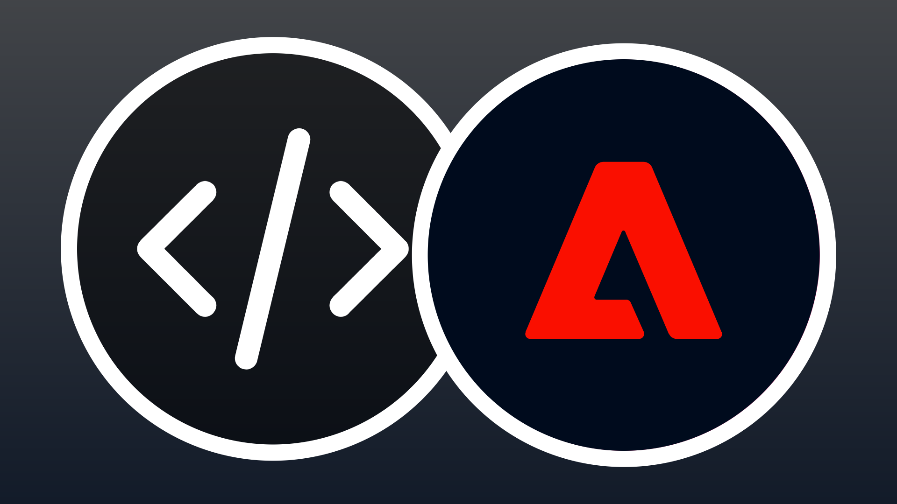

# API pour les créateurs

<!-- last-modified: 2026-06-02 -->


Les API d’entreprise Adobe CX donnent aux développeurs et aux outils de codage assistés par l’IA un accès direct aux données et aux workflows d’Adobe. Utilisez-les pour créer des applications personnalisées, automatiser les intégrations et incorporer les fonctionnalités d’Adobe dans vos propres systèmes. Les API sont le bon choix lorsque vous avez besoin d’un contrôle programmatique complet sur une intégration système ou que vous créez une application sur les données d’Adobe. Pour un accès conversationnel piloté par un agent aux workflows Adobe, reportez-vous à la section [Serveurs MCP](mcp-servers.md).

## API d’entreprise Adobe CX

Les API d’entreprise Adobe CX exposent les données et opérations de base qui alimentent des produits tels que Adobe Experience Platform, Journey Optimizer et Customer Journey Analytics. Chaque API suit une conception API-first, donnant aux développeurs et aux outils d’agence de codage assistés par l’IA un accès direct et programmable aux mêmes fonctionnalités qu’Adobe utilise en interne. Utilisez-les pour créer des applications personnalisées, automatiser les workflows et intégrer les données Adobe dans vos propres systèmes.

<!--
CARDS

* https://developer.adobe.com/audience-manager/
  {title = Audience Manager}
  {description = Audience management and activation workflows.}
  {cta = Explore API}
  {target = _blank}
  {image = ../assets/apis-aam-card.png}

* https://developer.adobe.com/client-sdks/home/
  {title = Client SDKs}
  {description = Mobile SDKs, edge SDKs, and in-app messaging.}
  {cta = Explore API}
  {target = _blank}
  {image = ../assets/apis-cxenterprise-card.png}

* https://developer.adobe.com/cja-apis/docs/
  {title = Customer Journey Analytics}
  {description = Analytics data access, reporting, and CJA insights workflows.}
  {cta = Explore API}
  {target = _blank}
  {image = ../assets/apis-cja-card.png}

* https://developer.adobe.com/data-collection-apis/docs/
  {title = Data Collection}
  {description = Edge Network data ingestion, real-time event collection, and streaming data delivery.}
  {cta = Explore API}
  {target = _blank}
  {image = ../assets/apis-aep-card.png}

* https://developer.adobe.com/developer-console/docs/guides/
  {title = Developer Console}
  {description = API project setup, authentication, and credential management.}
  {cta = Explore API}
  {target = _blank}
  {image = ../assets/apis-cxenterprise-card.png}

* https://developer.adobe.com/events/docs/
  {title = Events}
  {description = Event-driven integrations, webhooks, and automation triggers.}
  {cta = Explore API}
  {target = _blank}
  {image = ../assets/apis-cxenterprise-card.png}

* https://experienceleague.adobe.com/fr/docs/experience-platform/privacy/home
  {title = Privacy}
  {description = Privacy workflows, data governance, and data subject requests.}
  {cta = Explore API}
  {target = _blank}
  {image = ../assets/apis-aep-card.png}

* https://developer.adobe.com/experience-platform-apis/
  {title = Adobe Experience Platform}
  {description = CRUD operations for datasets, schemas, profiles, identities, queries, and segmentation.}
  {cta = Explore API}
  {target = _blank}
  {image = ../assets/apis-aep-card.png}

* https://developer.adobe.com/journey-optimizer-apis/
  {title = Adobe Journey Optimizer}
  {description = Journey orchestration, campaign management, content templates, and offer decisioning.}
  {cta = Explore API}
  {target = _blank}
  {image = ../assets/apis-ajo-card.png}

* https://developer.adobe.com/analytics-apis/docs/2.0/
  {title = Adobe Analytics}
  {description = Reporting, data feeds, calculated metrics, and segment management.}
  {cta = Explore API}
  {target = _blank}
  {image = ../assets/apis-analytics-card.png}

* https://experienceleague.adobe.com/en/docs/experience-manager-cloud-service/content/implementing/developing/apis-and-extensions
  {title = AEM as a Cloud Service}
  {description = Content, asset, and workflow management APIs for Adobe Experience Manager.}
  {cta = Explore API}
  {target = _blank}
  {image = ../assets/apis-aem-card.png}

* https://developer.adobe.com/commerce/webapi/
  {title = Adobe Commerce}
  {description = REST and GraphQL APIs for catalog, cart, orders, customers, and promotions.}
  {cta = Explore API}
  {target = _blank}
  {image = ../assets/apis-commerce-card.png}

* https://developer.adobe.com/umapi/
  {title = User Management}
  {description = User management, identity administration, and enterprise account automation.}
  {cta = Explore API}
  {target = _blank}
  {image = ../assets/apis-cxenterprise-card.png}
-->
<!-- START CARDS HTML - DO NOT MODIFY BY HAND -->
<div class="columns">
    <div class="column is-half-tablet is-half-desktop is-one-third-widescreen" aria-label="Audience Manager">
        <div class="card" style="height: 100%; display: flex; flex-direction: column; height: 100%;">
            <div class="card-image">
                <figure class="image x-is-16by9">
                    <a href="https://developer.adobe.com/audience-manager/" title="Audience Manager" target="_blank" rel="referrer">
                        
                    </a>
                </figure>
            </div>
            <div class="card-content is-padded-small" style="display: flex; flex-direction: column; flex-grow: 1; justify-content: space-between;">
                <div class="top-card-content">
                    <p class="headline is-size-6 has-text-weight-bold">
                        <a href="https://developer.adobe.com/audience-manager/" target="_blank" rel="referrer" title="Audience Manager">Audience Manager</a>
                    </p>
                    <p class="is-size-6">Workflows d’activation et de gestion des audiences.</p>
                </div>
                <a href="https://developer.adobe.com/audience-manager/" target="_blank" rel="referrer" class="spectrum-Button spectrum-Button--outline spectrum-Button--primary spectrum-Button--sizeM" style="align-self: flex-start; margin-top: 1rem;">
                    <span class="spectrum-Button-label has-no-wrap has-text-weight-bold">Explorer l’API</span>
                </a>
            </div>
        </div>
    </div>
    <div class="column is-half-tablet is-half-desktop is-one-third-widescreen" aria-label="Client SDKs">
        <div class="card" style="height: 100%; display: flex; flex-direction: column; height: 100%;">
            <div class="card-image">
                <figure class="image x-is-16by9">
                    <a href="https://developer.adobe.com/client-sdks/home/" title="SDK client" target="_blank" rel="referrer">
                        
                    </a>
                </figure>
            </div>
            <div class="card-content is-padded-small" style="display: flex; flex-direction: column; flex-grow: 1; justify-content: space-between;">
                <div class="top-card-content">
                    <p class="headline is-size-6 has-text-weight-bold">
                        <a href="https://developer.adobe.com/client-sdks/home/" target="_blank" rel="referrer" title="SDK client">SDK client</a>
                    </p>
                    <p class="is-size-6">SDK mobiles, SDK Edge et messagerie in-app.</p>
                </div>
                <a href="https://developer.adobe.com/client-sdks/home/" target="_blank" rel="referrer" class="spectrum-Button spectrum-Button--outline spectrum-Button--primary spectrum-Button--sizeM" style="align-self: flex-start; margin-top: 1rem;">
                    <span class="spectrum-Button-label has-no-wrap has-text-weight-bold">Explorer l’API</span>
                </a>
            </div>
        </div>
    </div>
    <div class="column is-half-tablet is-half-desktop is-one-third-widescreen" aria-label="Customer Journey Analytics">
        <div class="card" style="height: 100%; display: flex; flex-direction: column; height: 100%;">
            <div class="card-image">
                <figure class="image x-is-16by9">
                    <a href="https://developer.adobe.com/cja-apis/docs/" title="Customer Journey Analytics" target="_blank" rel="referrer">
                        
                    </a>
                </figure>
            </div>
            <div class="card-content is-padded-small" style="display: flex; flex-direction: column; flex-grow: 1; justify-content: space-between;">
                <div class="top-card-content">
                    <p class="headline is-size-6 has-text-weight-bold">
                        <a href="https://developer.adobe.com/cja-apis/docs/" target="_blank" rel="referrer" title="Customer Journey Analytics">Customer Journey Analytics</a>
                    </p>
                    <p class="is-size-6">Workflows d’accès aux données, de création de rapports et d’informations CJA.</p>
                </div>
                <a href="https://developer.adobe.com/cja-apis/docs/" target="_blank" rel="referrer" class="spectrum-Button spectrum-Button--outline spectrum-Button--primary spectrum-Button--sizeM" style="align-self: flex-start; margin-top: 1rem;">
                    <span class="spectrum-Button-label has-no-wrap has-text-weight-bold">Explorer l’API</span>
                </a>
            </div>
        </div>
    </div>
    <div class="column is-half-tablet is-half-desktop is-one-third-widescreen" aria-label="Data Collection">
        <div class="card" style="height: 100%; display: flex; flex-direction: column; height: 100%;">
            <div class="card-image">
                <figure class="image x-is-16by9">
                    <a href="https://developer.adobe.com/data-collection-apis/docs/" title="Collecte de données" target="_blank" rel="referrer">
                        
                    </a>
                </figure>
            </div>
            <div class="card-content is-padded-small" style="display: flex; flex-direction: column; flex-grow: 1; justify-content: space-between;">
                <div class="top-card-content">
                    <p class="headline is-size-6 has-text-weight-bold">
                        <a href="https://developer.adobe.com/data-collection-apis/docs/" target="_blank" rel="referrer" title="Collecte de données">Collecte de données</a>
                    </p>
                    <p class="is-size-6">Ingestion des données Edge Network, collecte d’événements en temps réel et diffusion de données en continu.</p>
                </div>
                <a href="https://developer.adobe.com/data-collection-apis/docs/" target="_blank" rel="referrer" class="spectrum-Button spectrum-Button--outline spectrum-Button--primary spectrum-Button--sizeM" style="align-self: flex-start; margin-top: 1rem;">
                    <span class="spectrum-Button-label has-no-wrap has-text-weight-bold">Explorer l’API</span>
                </a>
            </div>
        </div>
    </div>
    <div class="column is-half-tablet is-half-desktop is-one-third-widescreen" aria-label="Developer Console">
        <div class="card" style="height: 100%; display: flex; flex-direction: column; height: 100%;">
            <div class="card-image">
                <figure class="image x-is-16by9">
                    <a href="https://developer.adobe.com/developer-console/docs/guides/" title="Developer Console" target="_blank" rel="referrer">
                        
                    </a>
                </figure>
            </div>
            <div class="card-content is-padded-small" style="display: flex; flex-direction: column; flex-grow: 1; justify-content: space-between;">
                <div class="top-card-content">
                    <p class="headline is-size-6 has-text-weight-bold">
                        <a href="https://developer.adobe.com/developer-console/docs/guides/" target="_blank" rel="referrer" title="Developer Console"></a>
                    </p>
                    <p class="is-size-6">Configuration du projet API, authentification et gestion des informations d’identification.</p>
                </div>
                <a href="https://developer.adobe.com/developer-console/docs/guides/" target="_blank" rel="referrer" class="spectrum-Button spectrum-Button--outline spectrum-Button--primary spectrum-Button--sizeM" style="align-self: flex-start; margin-top: 1rem;">
                    <span class="spectrum-Button-label has-no-wrap has-text-weight-bold">Explorer l’API</span>
                </a>
            </div>
        </div>
    </div>
    <div class="column is-half-tablet is-half-desktop is-one-third-widescreen" aria-label="Events">
        <div class="card" style="height: 100%; display: flex; flex-direction: column; height: 100%;">
            <div class="card-image">
                <figure class="image x-is-16by9">
                    <a href="https://developer.adobe.com/events/docs/" title="Événements" target="_blank" rel="referrer">
                        
                    </a>
                </figure>
            </div>
            <div class="card-content is-padded-small" style="display: flex; flex-direction: column; flex-grow: 1; justify-content: space-between;">
                <div class="top-card-content">
                    <p class="headline is-size-6 has-text-weight-bold">
                        <a href="https://developer.adobe.com/events/docs/" target="_blank" rel="referrer" title="Événements">Événements</a>
                    </p>
                    <p class="is-size-6">Intégrations basées sur des événements, webhooks et triggers d’automatisation.</p>
                </div>
                <a href="https://developer.adobe.com/events/docs/" target="_blank" rel="referrer" class="spectrum-Button spectrum-Button--outline spectrum-Button--primary spectrum-Button--sizeM" style="align-self: flex-start; margin-top: 1rem;">
                    <span class="spectrum-Button-label has-no-wrap has-text-weight-bold">Explorer l’API</span>
                </a>
            </div>
        </div>
    </div>
    <div class="column is-half-tablet is-half-desktop is-one-third-widescreen" aria-label="Privacy">
        <div class="card" style="height: 100%; display: flex; flex-direction: column; height: 100%;">
            <div class="card-image">
                <figure class="image x-is-16by9">
                    <a href="https://experienceleague.adobe.com/fr/docs/experience-platform/privacy/home" title="Confidentialité" target="_blank" rel="referrer">
                        
                    </a>
                </figure>
            </div>
            <div class="card-content is-padded-small" style="display: flex; flex-direction: column; flex-grow: 1; justify-content: space-between;">
                <div class="top-card-content">
                    <p class="headline is-size-6 has-text-weight-bold">
                        <a href="https://experienceleague.adobe.com/fr/docs/experience-platform/privacy/home" target="_blank" rel="referrer" title="Confidentialité">Confidentialité</a>
                    </p>
                    <p class="is-size-6">Workflows de confidentialité, gouvernance des données et requêtes des titulaires de données.</p>
                </div>
                <a href="https://experienceleague.adobe.com/fr/docs/experience-platform/privacy/home" target="_blank" rel="referrer" class="spectrum-Button spectrum-Button--outline spectrum-Button--primary spectrum-Button--sizeM" style="align-self: flex-start; margin-top: 1rem;">
                    <span class="spectrum-Button-label has-no-wrap has-text-weight-bold">Explorer l’API</span>
                </a>
            </div>
        </div>
    </div>
    <div class="column is-half-tablet is-half-desktop is-one-third-widescreen" aria-label="Adobe Experience Platform">
        <div class="card" style="height: 100%; display: flex; flex-direction: column; height: 100%;">
            <div class="card-image">
                <figure class="image x-is-16by9">
                    <a href="https://developer.adobe.com/experience-platform-apis/" title="Adobe Experience Platform" target="_blank" rel="referrer">
                        
                    </a>
                </figure>
            </div>
            <div class="card-content is-padded-small" style="display: flex; flex-direction: column; flex-grow: 1; justify-content: space-between;">
                <div class="top-card-content">
                    <p class="headline is-size-6 has-text-weight-bold">
                        <a href="https://developer.adobe.com/experience-platform-apis/" target="_blank" rel="referrer" title="Adobe Experience Platform">Adobe Experience Platform</a>
                    </p>
                    <p class="is-size-6">Opérations CRUD pour les jeux de données, les schémas, les profils, les identités, les requêtes et la segmentation.</p>
                </div>
                <a href="https://developer.adobe.com/experience-platform-apis/" target="_blank" rel="referrer" class="spectrum-Button spectrum-Button--outline spectrum-Button--primary spectrum-Button--sizeM" style="align-self: flex-start; margin-top: 1rem;">
                    <span class="spectrum-Button-label has-no-wrap has-text-weight-bold">Explorer l’API</span>
                </a>
            </div>
        </div>
    </div>
    <div class="column is-half-tablet is-half-desktop is-one-third-widescreen" aria-label="Adobe Journey Optimizer">
        <div class="card" style="height: 100%; display: flex; flex-direction: column; height: 100%;">
            <div class="card-image">
                <figure class="image x-is-16by9">
                    <a href="https://developer.adobe.com/journey-optimizer-apis/" title="Adobe Journey Optimizer" target="_blank" rel="referrer">
                        
                    </a>
                </figure>
            </div>
            <div class="card-content is-padded-small" style="display: flex; flex-direction: column; flex-grow: 1; justify-content: space-between;">
                <div class="top-card-content">
                    <p class="headline is-size-6 has-text-weight-bold">
                        <a href="https://developer.adobe.com/journey-optimizer-apis/" target="_blank" rel="referrer" title="Adobe Journey Optimizer">Adobe Journey Optimizer</a>
                    </p>
                    <p class="is-size-6">orchestration des parcours, gestion des campagnes, modèles de contenu et Offer Decisioning.</p>
                </div>
                <a href="https://developer.adobe.com/journey-optimizer-apis/" target="_blank" rel="referrer" class="spectrum-Button spectrum-Button--outline spectrum-Button--primary spectrum-Button--sizeM" style="align-self: flex-start; margin-top: 1rem;">
                    <span class="spectrum-Button-label has-no-wrap has-text-weight-bold">Explorer l’API</span>
                </a>
            </div>
        </div>
    </div>
    <div class="column is-half-tablet is-half-desktop is-one-third-widescreen" aria-label="Adobe Analytics">
        <div class="card" style="height: 100%; display: flex; flex-direction: column; height: 100%;">
            <div class="card-image">
                <figure class="image x-is-16by9">
                    <a href="https://developer.adobe.com/analytics-apis/docs/2.0/" title="Adobe Analytics" target="_blank" rel="referrer">
                        
                    </a>
                </figure>
            </div>
            <div class="card-content is-padded-small" style="display: flex; flex-direction: column; flex-grow: 1; justify-content: space-between;">
                <div class="top-card-content">
                    <p class="headline is-size-6 has-text-weight-bold">
                        <a href="https://developer.adobe.com/analytics-apis/docs/2.0/" target="_blank" rel="referrer" title="Adobe Analytics">Adobe Analytics</a>
                    </p>
                    <p class="is-size-6">Rapports, flux de données, mesures calculées et gestion des segments.</p>
                </div>
                <a href="https://developer.adobe.com/analytics-apis/docs/2.0/" target="_blank" rel="referrer" class="spectrum-Button spectrum-Button--outline spectrum-Button--primary spectrum-Button--sizeM" style="align-self: flex-start; margin-top: 1rem;">
                    <span class="spectrum-Button-label has-no-wrap has-text-weight-bold">Explorer l’API</span>
                </a>
            </div>
        </div>
    </div>
    <div class="column is-half-tablet is-half-desktop is-one-third-widescreen" aria-label="Adobe Commerce">
        <div class="card" style="height: 100%; display: flex; flex-direction: column; height: 100%;">
            <div class="card-image">
                <figure class="image x-is-16by9">
                    <a href="https://developer.adobe.com/commerce/webapi/" title="Adobe Commerce" target="_blank" rel="referrer">
                        
                    </a>
                </figure>
            </div>
            <div class="card-content is-padded-small" style="display: flex; flex-direction: column; flex-grow: 1; justify-content: space-between;">
                <div class="top-card-content">
                    <p class="headline is-size-6 has-text-weight-bold">
                        <a href="https://developer.adobe.com/commerce/webapi/" target="_blank" rel="referrer" title="Adobe Commerce">Adobe Commerce</a>
                    </p>
                    <p class="is-size-6">API REST et GraphQL pour le catalogue, le panier, les commandes, les clients et les promotions.</p>
                </div>
                <a href="https://developer.adobe.com/commerce/webapi/" target="_blank" rel="referrer" class="spectrum-Button spectrum-Button--outline spectrum-Button--primary spectrum-Button--sizeM" style="align-self: flex-start; margin-top: 1rem;">
                    <span class="spectrum-Button-label has-no-wrap has-text-weight-bold">Explorer l’API</span>
                </a>
            </div>
        </div>
    </div>
    <div class="column is-half-tablet is-half-desktop is-one-third-widescreen" aria-label="User Management">
        <div class="card" style="height: 100%; display: flex; flex-direction: column; height: 100%;">
            <div class="card-image">
                <figure class="image x-is-16by9">
                    <a href="https://developer.adobe.com/umapi/" title="Gestion des utilisateurs" target="_blank" rel="referrer">
                        
                    </a>
                </figure>
            </div>
            <div class="card-content is-padded-small" style="display: flex; flex-direction: column; flex-grow: 1; justify-content: space-between;">
                <div class="top-card-content">
                    <p class="headline is-size-6 has-text-weight-bold">
                        <a href="https://developer.adobe.com/umapi/" target="_blank" rel="referrer" title="Gestion des utilisateurs">Gestion des utilisateurs</a>
                    </p>
                    <p class="is-size-6">Gestion des utilisateurs, administration des identités et automatisation des comptes d’entreprise.</p>
                </div>
                <a href="https://developer.adobe.com/umapi/" target="_blank" rel="referrer" class="spectrum-Button spectrum-Button--outline spectrum-Button--primary spectrum-Button--sizeM" style="align-self: flex-start; margin-top: 1rem;">
                    <span class="spectrum-Button-label has-no-wrap has-text-weight-bold">Explorer l’API</span>
                </a>
            </div>
        </div>
    </div>
</div>
<!-- END CARDS HTML - DO NOT MODIFY BY HAND -->


## API pour Builders et serveurs MCP

Utilisez les API lorsque vous avez besoin d’un contrôle total de l’intégration du système ou que vous créez une application personnalisée. Utilisez les serveurs MCP lorsque vous souhaitez qu’un agent d’IA travaille directement avec les workflows Adobe.

| | API | Serveurs MCP |
| --- | --- | --- |
| Intégration directe du système | Oui | Parfois |
| Orchestration conviviale pour les agents | Limité | Oui |
| Accès aux données brutes | Oui | Généralement abstrait |
| Développement d’applications personnalisées | Cas d’utilisation du Principal | Secondaire |
| Workflows assistés par l’IA | Pris en charge | Cas d’utilisation du Principal |

## Prise en main des API pour Builders


Avant de pouvoir créer des API d’entreprise Adobe CX, deux éléments sont nécessaires : des informations d’identification authentifiées de Adobe Developer Console et l’ajout d’une documentation d’API à votre projet afin que votre agent de codage puisse travailler avec les API d’Adobe de manière fiable.

### Configuration des informations d’identification d’API dans Adobe Developer Console

Tout accès à l’API d’entreprise Adobe CX est géré via [Adobe Developer Console](https://developer.adobe.com/developer-console/docs/guides/). Créez un projet, ajoutez les API dont votre application a besoin et générez des informations d’identification.

1. Connectez-vous et [créez un projet](https://developer.adobe.com/developer-console/docs/guides/projects/) dans Adobe Developer Console.
2. [Ajoutez l’API](https://developer.adobe.com/developer-console/docs/guides/services/) pour l’application Adobe CX Enterprise dont vous avez besoin.
3. Choisissez un [type d’authentification](https://developer.adobe.com/developer-console/docs/guides/authentication/). Utilisez **OAuth de serveur à serveur** pour les workflows automatisés ou **OAuth Web App** pour les applications orientées utilisateur.
4. Générez vos informations d’identification. Notez l’ID client, le secret client et le point d’entrée du jeton à utiliser dans votre application.

La plupart des API d’entreprise Adobe CX nécessitent une licence d’application. Si une API n’est pas disponible dans votre projet Developer Console, contactez votre représentant Adobe.

### Ajouter le contexte de l’API Adobe à votre projet

Les agents de codage de l’IA peuvent découvrir et utiliser de manière fiable les API Adobe lorsque vous ajoutez le matériel de référence approprié à votre projet. Cela fonctionne pour toute API d’entreprise Adobe CX qui publie une spécification OpenAPI.

**1. Recherchez la spécification d’API**

Parcourez les [API Adobe CX Enterprise](#adobe-cx-enterprise-apis) répertoriées ci-dessus ou accédez directement au [catalogue d’API Adobe Developer](https://developer.adobe.com/apis).

**2. Téléchargez la spécification OpenAPI**

Créez un répertoire `/specs` dans votre projet. Téléchargez le YAML OpenAPI à partir de la page des références d’API sur [developer.adobe.com](https://developer.adobe.com/apis) et enregistrez-le. Ajoutez un `README.md` qui enregistre l’URL source et la date de téléchargement.

```
/specs/README.md
/specs/aem-assets.openapi.yaml
```

>[!TIP]
>Un instantané archivé donne à votre agent de codage un comportement stable et reproductible et rend les modifications d’API visibles dans votre historique Git.

**3. Générez un index API**

Collez cette invite dans votre agent de codage, en remplaçant `<API-SPEC-FILE>` par votre nom de fichier :

```
Read /specs/<API-SPEC-FILE>.openapi.yaml and generate /docs/<API-SPEC-FILE>.api.md.

Create a concise API index for AI coding agents. For each operation include: operationId, HTTP method, path, purpose, authentication requirements, required inputs, response shape, common error responses, pagination behavior, asynchronous behavior, and deprecation status.

Do not invent endpoints, parameters, request bodies, response fields, or behavior not present in the OpenAPI specification.
```

**4. Générez les instructions de l’agent**

```
Read /specs/<API-SPEC-FILE>.openapi.yaml and /docs/<API-SPEC-FILE>.api.md.

Generate AGENTS.md. Instructions should:
- Treat the OpenAPI specification as the source of truth.
- Use the API index as a navigation guide.
- Never invent endpoints, parameters, response fields, or status codes.
- Prefer documented operationIds.
- Avoid deprecated or experimental APIs unless explicitly requested.
- Follow authentication requirements defined in the specification.
- Use the local OpenAPI snapshot for implementation decisions.
```

**5. Vérifier**

Demandez à votre agent de codage d’effectuer une tâche simple en utilisant uniquement les fichiers générés :

```
Write a function that takes an AEM asset ID and returns the asset title and description. Use only /specs/aem-assets.openapi.yaml and /docs/aem-assets.api.md.
```

Si l’agent l’effectue correctement sans inventer de comportement, la configuration est terminée.

**Structure de projet recommandée**

```
project/
├── specs/
│   ├── README.md
│   └── aem-assets.openapi.yaml
├── docs/
│   └── aem-assets.api.md
└── AGENTS.md
```

**Actualisation des spécifications**

Lorsqu’Adobe publie une nouvelle version d’API : téléchargez un nouvel instantané dans `/specs`, mettez à jour la date dans `README.md`, puis régénérez l’index et le `AGENTS.md`.
