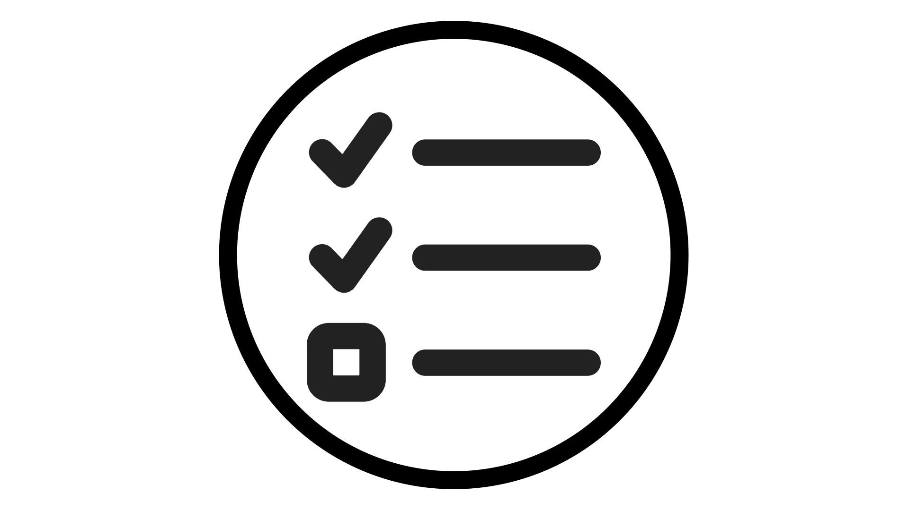

# Outils Agentic

<!-- last-modified: 2026-06-08 -->

Tous les outils agentiques ne répondent pas au même besoin. Découvrez ce que chacun fait, quand l’utiliser et comment commencer à l’utiliser, afin de pouvoir choisir le bon point de départ pour votre situation.

<!--
CARDS

* mcp-servers.md
  {title = MCP Servers}
  {description = Connect any compatible AI client to Adobe CX Enterprise data and workflows. No coding required.}
  {cta = Explore MCP Servers}
  {image = ../assets/mcp-servers-card.png}

* agent-skills.md
  {title = Agent Skills}
  {description = Adobe-curated workflow instructions that guide agents through CX Enterprise tasks consistently.}
  {cta = Explore Agent Skills}
  {image = ../assets/agent-skills-card.png}

* apis.md
  {title = APIs for Builders}
  {description = Build custom applications and integrations using the same APIs that power Adobe products.}
  {cta = Explore APIs for Builders}
  {image = ../assets/apis-card.png}

-->
<!-- START CARDS HTML - DO NOT MODIFY BY HAND -->

    

        

            

                <figure class="image x-is-16by9">
                    
                </figure>
            

            

                

                    

                        <a href="mcp-servers.md" target="_blank" rel="referrer" title="Serveurs MCP"> Serveurs MCP </a>
                    

                    
Connectez n’importe quel client IA compatible aux données et workflows Adobe CX Enterprise. Aucun codage requis.

                

                <a href="mcp-servers.md" target="_blank" rel="referrer" class="spectrum-Button spectrum-Button--outline spectrum-Button--primary spectrum-Button--sizeM" style="align-self: flex-start; margin-top: 1rem;">
                    Explorer les serveurs MCP
                </a>
            

        

    

    

        

            

                <figure class="image x-is-16by9">
                    
                </figure>
            

            

                

                    

                        <a href="agent-skills.md" target="_blank" rel="referrer" title="Compétences de l’agent">Compétences agent</a>
                    

                    
Instructions de workflow traitées par Adobe qui guident les agents de manière cohérente tout au long des tâches CX Enterprise.

                

                <a href="agent-skills.md" target="_blank" rel="referrer" class="spectrum-Button spectrum-Button--outline spectrum-Button--primary spectrum-Button--sizeM" style="align-self: flex-start; margin-top: 1rem;">
                    Explorer les compétences de l’agent
                </a>
            

        

    

    

        

            

                <figure class="image x-is-16by9">
                    
                </figure>
            

            

                

                    

                        <a href="apis.md" target="_blank" rel="referrer" title="API pour les créateurs">API pour Builders</a>
                    

                    
Créez des applications et des intégrations personnalisées en utilisant les mêmes API que celles qui alimentent les produits Adobe.

                

                <a href="apis.md" target="_blank" rel="referrer" class="spectrum-Button spectrum-Button--outline spectrum-Button--primary spectrum-Button--sizeM" style="align-self: flex-start; margin-top: 1rem;">
                    Explorer les API pour Builders
                </a>
            

        

    

<!-- END CARDS HTML - DO NOT MODIFY BY HAND -->

## Comparer les outils agentiques

| | Serveurs MCP | Compétences de l’agent | API pour les créateurs |
| --- | --- | --- | --- |
| Idéal pour | Utilisateurs de l’application d’entreprise CX | Utilisateurs et développeurs d’applications d’entreprise CX | Développeurs |
| Nécessite un codage | Non | Non | Oui |
| Heure de configuration | Minutes | Minutes | Heures en jours |
| Ce que vous obtenez | Accès aux applications CX Enterprise à partir de vos clients AI | Workflows guidés et reproductibles | Contrôle programmatique complet |

## Vous ne savez pas par où commencer ?

- Pour utiliser l’IA afin d’interagir avec les applications d’entreprise CX (prendre des mesures, interroger des données et laisser l’IA découvrir ce qu’il doit faire ensuite par le biais d’une conversation naturelle), les [serveurs MCP](mcp-servers.md) constituent le point de départ le plus flexible.
- Pour que les agents suivent de manière cohérente les bonnes pratiques d’Adobe pour les workflows CX Enterprise sans improvisation, [les compétences des agents](agent-skills.md) codent cette expertise de domaine dans des instructions réutilisables.
- Pour créer une application ciblée qui simplifie ou automatise un workflow CX Enterprise spécifique pour vos utilisateurs, les [API pour les créateurs](apis.md) vous permettent de contrôler directement et par programmation ce qui se passe exactement.

>[!BEGINTABS]

>[!TAB  Serveurs MCP ]

Considérez les serveurs MCP comme un lien dynamique entre votre client IA et les applications CX Enterprise. Connectez-vous une seule fois et votre IA peut interroger les campagnes, extraire les audiences, vérifier le statut du parcours, etc. Le tout en langage clair, sans code nécessaire.

**Utiliser des serveurs MCP quand :**

- Vous souhaitez intégrer l’IA directement dans vos workflows CX Enterprise.
- Vous souhaitez que les données CX Enterprise se trouvent dans le client AI que vous utilisez déjà
- Vous effectuez une analyse exploratoire ou une récupération de données ad hoc
- Vous souhaitez obtenir des résultats rapidement, sans démarrer de projet

[Explorer les serveurs MCP](mcp-servers.md)

>[!TAB Compétences agent]

Les compétences de l’agent sont des compétences de domaine Adobe, encodées en instructions que votre agent peut suivre. Au lieu d&#39;espérer que votre agent comprenne les bonnes étapes, une compétence lui indique exactement ce qu&#39;il doit faire, de manière fiable, répétée et déjà adaptée aux workflows CX Enterprise.

**Utiliser les compétences de l’agent lorsque :**

- Vous souhaitez suivre les bonnes pratiques d’Adobe lors de l’exécution de tâches dans les applications d’entreprise CX via des clients AI
- Vous souhaitez que la même tâche soit effectuée de la même manière à chaque fois
- Vous exécutez des workflows de production de contenu ou de médias répétables.

[Explorer les compétences de l’agent](agent-skills.md)

>[!TAB API pour Builders]

Les API sont les blocs de création. Ils permettent aux développeurs d’accéder directement et par programmation aux données et aux opérations d’Adobe, en utilisant les mêmes API que celles qui alimentent leurs propres produits Adobe. Utilisez-les pour créer des expériences personnalisées ciblées qui rationalisent des workflows d’entreprise spécifiques avec les mécanismes de sécurisation dont votre entreprise a besoin.

**Utiliser des API quand :**

- Vous créez une application ou une intégration personnalisée pour un cas d’utilisation professionnel spécifique
- Vous devez optimiser ou automatiser un workflow avec des mécanismes de sécurisation et des contrôles spécifiques
- Vous utilisez Claude Code ou Cursor pour générer une application complète
- Vous devez intégrer les données CX Enterprise dans un autre système

[Explorer les API pour Builders](apis.md)

>[!ENDTABS]

## Les utiliser ensemble

Ces outils sont conçus pour fonctionner ensemble. C’est en les combinant que vous tirez le meilleur parti d’Adobe AI. Les compétences des agents peuvent guider la manière dont un client d’IA utilise les serveurs MCP, ce qui permet aux agents de rester sur la bonne voie pour les workflows d’entreprise CX. Les compétences peuvent également indiquer comment et à quel moment appeler les API, en ajoutant les mécanismes de sécurisation des bonnes pratiques Adobe aux automatisations personnalisées. Vous n&#39;avez pas à en choisir un seul.
