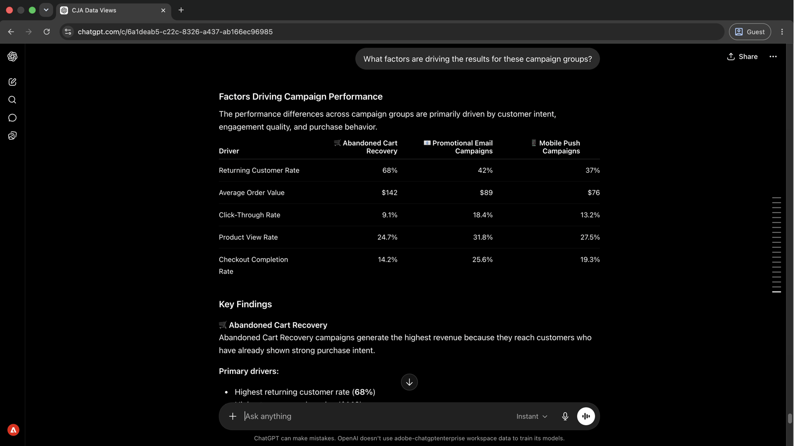

# Affichage des informations sur les campagnes sans création de rapports

<!-- last-modified: 2026-06-02 -->

Client 

L’analyse des campagnes qui nécessitait autrefois la création de rapports dans un outil distinct est désormais une conversation. Cette présentation explique comment connecter un client d’IA à Customer Journey Analytics (CJA) et poser des questions sur les performances en langage clair. Le temps d’accès à insight est ainsi plus rapide et aucune création de rapports manuelle n’est nécessaire.

| Détails du scénario | |
| --- | --- |
| **Applications d’entreprise CX** | [Customer Journey Analytics (CJA)](https://experienceleague.adobe.com/en/docs/analytics-platform/using/cja-overview/cja-overview) |
| **Outils Agentic** | [CX Enterprise MCP](../tools/mcp-servers.md#cx-enterprise-mcp-servers) |
| **Audience** | Analystes, responsables de campagne |
| **Prérequis** | Client d’IA compatible avec MCP, accès à CJA |

Chaque étape affiche une invite représentative et un exemple de réponse de l’IA. La section **Plus que vous pouvez accomplir** suit pour une exploration supplémentaire au cours de la même session.

## Avant de commencer

>[!BEGINTABS]

>[!TAB Claude.ai]

Connectez CX Enterprise MCP en tant que connecteur personnalisé pour accéder aux outils Customer Journey Analytics.

1. Accédez à **Paramètres > Intégrations** dans Claude.ai.
2. Sélectionnez **Ajouter un connecteur personnalisé** et saisissez l’URL du serveur : `https://cx-enterprise.adobe.io/mcp`
3. Sélectionnez **Connexion** et connectez-vous avec votre Adobe ID.

Configuration complète : [documentation des connecteurs personnalisés Claude.ai](https://support.claude.com/en/articles/11175166-get-started-with-custom-connectors-using-remote-mcp)

>[!TAB ChatGPT]

Connectez le CX Enterprise MCP à l&#39;aide du mode Développeur ChatGPT (Pro, Plus, Business, Enterprise ou Education plan requis).

1. Activez le **mode Développeur** dans **Paramètres ChatGPT**.
2. Accédez à **Paramètres > Intégrations** et sélectionnez **Ajouter un connecteur personnalisé > Serveur MCP distant**.
3. Saisissez l’URL du serveur : `https://cx-enterprise.adobe.io/mcp`
4. Sélectionnez **Connexion** et connectez-vous avec votre Adobe ID.

Configuration complète : [documentation MCP ChatGPT](https://developers.openai.com/api/docs/guides/tools-connectors-mcp)

>[!TAB Autres clients d’IA]

Utiliser Gemini, Microsoft Copilot, Cursor, Claude Code ou un autre environnement compatible avec MCP ? Connectez-vous au MCP d’entreprise CX à l’aide de ce point d’entrée :

```
https://cx-enterprise.adobe.io/mcp
```

Instructions de configuration complètes pour tous les clients pris en charge : [Connexion à votre client IA](../tools/mcp-servers.md)

>[!ENDTABS]

>[!NOTE]
>
>Connectez-vous avec votre Adobe ID lorsque vous y êtes invité et sélectionnez l’organisation IMS liée à vos vues de données CJA. Choisir la mauvaise organisation est la source la plus courante d’erreurs d’authentification.
>
>Lors de la première connexion, votre client d’IA peut vous demander de sélectionner une organisation IMS ou de spécifier un sandbox. Une fois ce contexte défini, le serveur MCP l’utilise pour le reste de la session.
>
>Certains outils vous demandent votre approbation avant de s’exécuter. Examinez la demande et approuvez ou refusez. Aucune action n’est entreprise sans votre confirmation.

## Étape 1 : découvrir les vues de données disponibles

Commencez par demander à votre client d’IA de répertorier les vues de données disponibles dans votre compte CJA. Il indique les jeux de données que vous pouvez interroger avant d’exécuter des rapports.

```
What data views are available in my CJA account?
```

+++Voir un exemple de réponse


+++


## Étape 2 : extraire les données de performances de la campagne

Une fois la vue de données identifiée, demandez les performances de la campagne par chiffre d’affaires et taux de conversion. L’IA résout les noms des mesures et des dimensions à partir de la vue de données sans nécessiter d’identifiants techniques.

```
For '[data view name]', show me the top campaigns by revenue and conversion rate for the last 30 days.
```

+++Voir un exemple de réponse

Client 

+++


>[!NOTE]
>
>Remplacez `[data view name]` par le nom de votre vue de données de l’étape 1. Vérifiez les résultats dans Analysis Workspace en utilisant la même vue de données et la même période avant de partager avec les parties prenantes.

## Étape 3 : identifier ce qui stimule les performances

Demandez à votre client d’IA d’expliquer ce qui motive les différences de performances entre les groupes de campagne. Cela permet de passer des numéros de titre aux variables en dessous.

```
What factors are driving the results for these campaign groups?
```

+++Voir un exemple de réponse

Client 

+++


## Étape 4 : accéder à un type de campagne spécifique

Donner suite à un résultat spécifique en demandant une répartition au niveau du segment. Les types de clients qui génèrent des performances au sein d’un type de campagne apparaissent.

```
Break down Promotional Email Campaigns by Customer Segment and explain what's driving the high conversion rate.
```

+++Voir un exemple de réponse


+++


## Étape 5 : Agir sur ce que vous avez trouvé

Demandez des recommandations hiérarchisées en fonction de tout ce qui a été abordé au cours de la session. Demander des estimations de valeur commerciale vous aide à décider par où agir en premier.

```
Based on these findings, recommend the highest-impact actions to increase revenue and conversion rates. Prioritize recommendations by expected business value and estimate the potential uplift.
```

+++Voir un exemple de réponse


+++


>[!NOTE]
>
>Les outils CJA accessibles par le biais du MCP Entreprise CX peuvent créer des segments, des mesures calculées et des projets Workspace dans CJA au cours de la même session. Pour mettre à jour des campagnes, des parcours ou du contenu dans d’autres applications, connectez le serveur MCP approprié ou accédez directement à l’application.

## Ce que vous avez accompli

Vous avez connecté un client d’IA à Customer Journey Analytics et êtes passé de la découverte de vues de données à des recommandations commerciales prioritaires en cinq invites. Vous avez identifié les principales campagnes par chiffre d’affaires et taux de conversion, fait apparaître les facteurs qui déterminent les performances des groupes de campagnes, exploré les détails au niveau du segment pour un type de campagne spécifique et reçu des recommandations classées avec une augmentation estimée. Cette approche remplace la création de rapports par une conversation directe, ce qui réduit le temps entre une question commerciale et un plan d’action soutenu par les données.

## Plus de choses à accomplir

Le CX Enterprise MCP peut afficher beaucoup plus d’informations sur Customer Journey Analytics que les couvertures de présentation. Développez un scénario ci-dessous pour afficher les invites que vous pouvez essayer dans la même session.

+++Trouver ce qui fonctionne et ce qui ne fonctionne pas

Un aperçu rapide des campagnes diffusées et de celles qui ne le sont pas vous permet de concentrer les efforts avant d’examiner les rapports détaillés. Ces invites vous donnent cette image en une seule session.

**Invites**

```
Which campaigns are driving the most revenue and conversions?
```

```
Show me the campaigns that need attention this month.
```

```
What channels are outperforming expectations?
```

```
Identify the biggest performance changes compared to last month.
```

```
Show me conversion performance by traffic source.
```

+++

+++Comprendre ce qui génère des résultats

Les mesures des titres vous disent ce qui s’est passé. Ces invites vous aident à comprendre pourquoi : quels segments, canaux et points de contact se trouvent derrière les chiffres.

**Invites**

```
What factors are driving revenue growth?
```

```
Explain why conversion rates changed this quarter.
```

```
Break down campaign performance by customer segment.
```

```
Which customer segments are growing fastest?
```

```
Which touchpoints contribute most to conversions?
```

+++

+++Découvrir les opportunités de croissance

Savoir où les performances sont fortes n&#39;est qu&#39;une partie du tableau. Ces invites vous aident à identifier les domaines dans lesquels vous pouvez investir davantage, les audiences qui disposent d&#39;une marge de manœuvre et les campagnes prêtes à être déployées.

**Invites**

```
Where should we invest more marketing budget?
```

```
Which audiences have the greatest growth potential?
```

```
Which campaigns should we scale?
```

```
What would have the biggest impact on revenue?
```

+++

+++Transformer les informations en action

Les outils CJA accessibles via le client MCP Entreprise CX peuvent créer des segments, des audiences, des mesures calculées et des projets Workspace directement dans CJA sans quitter votre session d’IA. Utilisez ces invites pour agir sur ce que vous avez trouvé.

**Invites**

```
Create a segment for high-value customers.
```

```
Build an audience from recent purchasers.
```

```
Create a calculated metric for conversion efficiency.
```

```
Save this analysis as a Workspace project for executive reporting.
```

+++


## Informations supplémentaires

| Ressource | Ce que vous trouverez |
| --- | --- |
| [Documentation du serveur MCP ](https://developer.adobe.com/analytics-mcp/docs/cja/) | Guide complet de configuration et de référence des outils |
| [Guides d’utilisation de CJA MCP](https://developer.adobe.com/analytics-mcp/docs/guides/) | Guides d’utilisation détaillés |
| [Serveur CJA MCP dans le registre IA](https://developer.adobe.com/ai-registry/#/mcp/cja-mcp) | Disponibilité et outils du serveur CJA MCP |
| [Documentation ](https://experienceleague.adobe.com/fr/docs/analytics-platform/using/cja-landing) | Documentation complète de l’application CJA |
