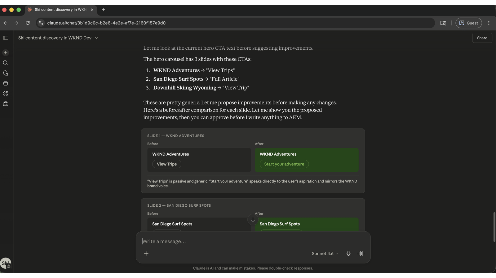

# Tenez le contenu à jour et envoyez les mises à jour plus rapidement

<!-- last-modified: 2026-05-22 -->


Les opérations de contenu dans Adobe Experience Manager, depuis la recherche de pages et la révision du contenu jusqu’à la mise à jour et la publication, nécessitent généralement de naviguer directement dans l’interface d’AEM. Cette présentation explique comment gérer ces opérations via un client d’IA à l’aide du serveur de gestion de contenu AEM, afin que les équipes de contenu puissent se déplacer plus rapidement sans basculer entre les outils.

| Détails du scénario | |
| --- | --- |
| **Applications d’entreprise CX** | [Adobe Experience Manager as a Cloud Service](https://experienceleague.adobe.com/fr/docs/experience-manager-cloud-service/content/overview/introduction) |
| **Outils Agentic** | [Serveur AEM Content MCP](https://experienceleague.adobe.com/en/docs/experience-manager-cloud-service/content/ai-in-aem/using-mcp-with-aem-as-a-cloud-service) |
| **Audience** | Gestionnaires de contenu, équipes marketing |
| **Prérequis** | Client d’IA compatible avec MCP, accès à AEM as a Cloud Service |

Chaque étape affiche une invite représentative et un exemple de réponse de l’IA. La section **Plus que vous pouvez accomplir** suit pour une exploration supplémentaire au cours de la même session.

## Avant de commencer

>[!BEGINTABS]

>[!TAB Claude.ai]

Connectez AEM Content MCP Server en tant que connecteur personnalisé.

1. Accédez à **Paramètres > Intégrations** dans Claude.ai.
2. Sélectionnez **Ajouter un connecteur personnalisé** et saisissez l’URL du serveur : `https://mcp.adobeaemcloud.com/adobe/mcp/content`
3. Sélectionnez **Connexion** et connectez-vous avec votre Adobe ID.

Configuration complète : [documentation des connecteurs personnalisés Claude.ai](https://support.claude.com/en/articles/11175166-get-started-with-custom-connectors-using-remote-mcp)

>[!TAB ChatGPT]

Connectez le serveur AEM Content MCP à l’aide du mode Développeur ChatGPT (Pro, Plus, Business, Enterprise ou Education plan requis).

1. Activez le **mode Développeur** dans **Paramètres ChatGPT**.
2. Accédez à **Paramètres > Intégrations** et sélectionnez **Ajouter un connecteur personnalisé > Serveur MCP distant**.
3. Saisissez l’URL du serveur : `https://mcp.adobeaemcloud.com/adobe/mcp/content`
4. Sélectionnez **Connexion** et connectez-vous avec votre Adobe ID.

Configuration complète : [documentation MCP ChatGPT](https://developers.openai.com/api/docs/guides/tools-connectors-mcp)

>[!TAB Autres clients d’IA]

Utiliser Gemini, Microsoft Copilot, Cursor, Claude Code ou un autre environnement compatible avec MCP ? Connectez-vous au serveur AEM Content MCP à l’aide de ce point d’entrée :

```
https://mcp.adobeaemcloud.com/adobe/mcp/content
```

Instructions de configuration complètes pour tous les clients pris en charge : [Connexion à votre client IA](../tools/mcp-servers.md)

>[!ENDTABS]

>[!NOTE]
>
>Connectez-vous avec votre Adobe ID lorsque vous y êtes invité et sélectionnez l’organisation IMS liée à votre environnement AEM as a Cloud Service. Les autorisations sont appliquées au niveau d’AEM. Votre client d’IA peut uniquement effectuer des opérations pour lesquelles votre compte est autorisé.
>
>Si vous devez uniquement parcourir ou auditer le contenu sans apporter de modifications, utilisez plutôt le point d’entrée de serveur en lecture seule : `https://mcp.adobeaemcloud.com/adobe/mcp/content-readonly`. Toutes les invites de découverte et de révision de cette page fonctionnent avec les deux serveurs.
>
>Lors de la première connexion, votre client d’IA peut vous demander de confirmer votre organisation ou l’environnement AEM. Une fois ce contexte défini, le serveur MCP l’utilise pour le reste de la session.
>
>Certains outils vous demandent votre approbation avant de s’exécuter. Examinez la mesure proposée et approuvez ou refusez. Aucune modification n’est apportée sans votre confirmation.

## Étape 1 : recherche de contenu dans l’ensemble de votre environnement AEM

Commencez par demander à votre client d’IA de découvrir vos environnements AEM et de rechercher du contenu. Vous pouvez effectuer des recherches par sujet, mot-clé ou type de contenu sans connaître les chemins exacts.

```
From WKND Dev environment, find all ski related content.
```

+++Voir un exemple de réponse

Client 

+++


## Étape 2 : vérifier une page spécifique

Une fois que vous avez trouvé le contenu approprié, demandez à votre client d’IA de vous afficher une page spécifique. Vous pouvez faire référence aux pages par leur nom ou leur chemin d’accès. Le serveur MCP résout la référence et renvoie la structure du contenu.

```
Show me the US English Home Page.
```

+++Voir un exemple de réponse

Client 

+++


## Étape 3 : améliorer le contenu

Une fois le contenu de la page affiché, demandez à votre client d’IA de suggérer ou d’appliquer des améliorations. L’IA peut proposer des modifications de copie basées sur ce que la page dit actuellement et demander une confirmation avant d’écrire quoi que ce soit.

```
Improve the Hero CTAs.
```

+++Voir un exemple de réponse



+++


>[!CAUTION]
>
>Confirmez chaque modification lorsque vous y êtes invité. AEM Content MCP Server peut créer, mettre à jour et supprimer du contenu. Examinez la modification proposée avant l’approbation, en particulier sur les pages actives.

## Étape 4 : publier et partager

Après avoir confirmé la mise à jour, publiez la page et récupérez une URL partageable, le tout dans la même conversation.

```
Publish the changes and share the URL.
```

+++Voir un exemple de réponse


+++


## Ce que vous avez accompli

Vous avez utilisé AEM Content MCP Server pour rechercher du contenu, passer en revue une page active, apporter des améliorations suggérées par l’IA et publier le résultat, sans ouvrir l’interface d’AEM. En associant la découverte, la modification et la publication de contenu dans une seule session d’IA, les équipes de contenu peuvent passer de l’identification d’un écart à l’envoi et à la mise à jour plus rapidement et avec moins de changements de contexte. Le même workflow se met à l’échelle à plusieurs pages, fragments de contenu et lancements de campagne coordonnés.

## Plus de choses à accomplir

Le serveur AEM Content MCP gère bien plus que les couvertures de la présentation. Développez un scénario ci-dessous pour afficher les invites que vous pouvez essayer dans la même session.

+++Anticiper la révision ou la relance d’un site

Les audits de contenu prennent du temps lorsqu’ils sont effectués manuellement. Ces invites vous permettent de faire rapidement apparaître le contenu obsolète, les brouillons qui n&#39;ont jamais été envoyés et les trous qui doivent être corrigés avant une notification push majeure.

**Invites**

```
Show me everything updated in the last two weeks.
```

```
What content is sitting in draft and hasn't been published yet?
```

```
Find pages that haven't been touched in over a year.
```

```
Which pages are missing their description field?
```

```
We're reorganizing the taxonomy. Find all articles missing tags or categories.
```

+++

+++Correction des problèmes d’optimisation pour les moteurs de recherche et d’accessibilité à grande échelle

Les écarts d’optimisation pour les moteurs de recherche et d’accessibilité se multiplient rapidement sur les sites volumineux. Ces invites vous aident à trouver et à classer par priorité les problèmes les plus importants avant un audit ou un lancement.

**Invites**

```
Pull a list of all pages with an empty meta description.
```

```
Which pages have thin content that's likely to underperform for SEO?
```

```
Find all images missing alt text.
```

```
Our CTAs aren't consistent. Scan the site and flag anywhere the call-to-action wording differs from "Book now."
```

```
The homepage was updated yesterday. Show me what changed compared to the version before.
```

+++

+++Gardez votre bibliothèque de ressources organisée et prête

Les références de ressources endommagées et les chargements non traités ralentissent la production de contenu. Ces invites vous aident à rechercher et à gérer les ressources avant de bloquer une mise à jour de page ou une campagne.

**Invites**

```
We're building a biking content series. What image assets do we already have?
```

```
Can you upload a placeholder asset from https://placehold.co/800x450/png to the wknd folder and save it as placeholder.png?
```

```
That asset was just uploaded. Is it processed and ready to use in a page?
```

```
I need to replace the hero image across the site. Which fragments are currently using it?
```

+++

+++Coordination du lancement d’un contenu sur plusieurs pages

Le lancement d’une campagne implique souvent la coordination des modifications entre plusieurs fragments de contenu et pages. Ces invites vous aident à regrouper les mises à jour, à les examiner avant de les promouvoir et à les expédier proprement.

**Invites**

```
I need to update the surfing adventure. Show me its content and all its fields.
```

```
Create an EMEA market variation of the ski adventure fragment.
```

```
Bundle everything we changed in this session into a launch called May Updates.
```

```
What launches are open right now, and which ones are ready to promote?
```

```
Before I promote, show me exactly what changed between May Updates and what is currently live.
```

```
Promote the May Updates launch to production.
```

+++


## Informations supplémentaires

| Ressource | Ce que vous trouverez |
| --- | --- |
| [Documentation d’AEM Content MCP Server](https://experienceleague.adobe.com/en/docs/experience-manager-cloud-service/content/ai-in-aem/using-mcp-with-aem-as-a-cloud-service) | Guide de configuration et d’utilisation du serveur MCP |
| [Serveur AEM Content MCP dans le registre AI](https://developer.adobe.com/ai-registry/#/mcp/aem-content-mcp) | Liste des outils et disponibilité |
| [Documentation d’AEM as a Cloud Service](https://experienceleague.adobe.com/en/docs/experience-manager-cloud-service) | Documentation complète de l’application AEM |
| [fragments de contenu ](https://experienceleague.adobe.com/en/docs/experience-manager-cloud-service/content/assets/content-fragments/content-fragments) | Référence de création de fragment de contenu |
| [ Serveurs MCP ](../tools/mcp-servers.md) | Connexion d’un client d’IA aux serveurs MCP Adobe |
