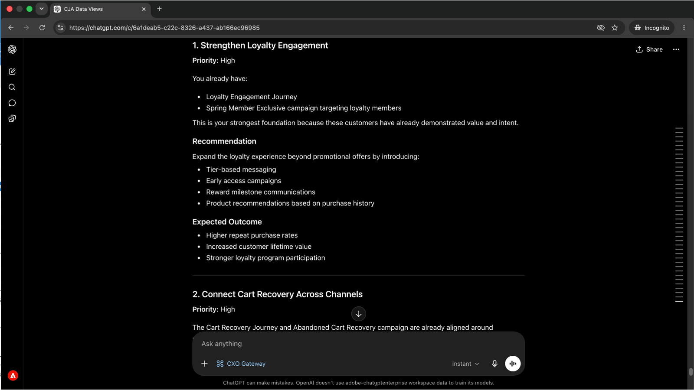

# Surveillez les problèmes de parcours avant qu’ils n’affectent les clients
<!-- last-modified: 2026-06-08 -->


Les problèmes de parcours qui ne sont pas détectés peuvent atteindre les clients avant que quiconque ne s’en aperçoive. Cette présentation explique comment anticiper ces problèmes en vérifiant les parcours AJO actifs, en examinant la configuration de la campagne et en faisant apparaître les problèmes opérationnels par le biais d’un client d’IA, à l’aide du MCP Entreprise CX pour obtenir des réponses en langage clair sans ouvrir Adobe Journey Optimizer.

| Détails du scénario | |
| --- | --- |
| Applications d’entreprise CX | [Adobe Journey Optimizer (AJO)](https://experienceleague.adobe.com/fr/docs/journey-optimizer/using/ajo-home) |
| Outils agentiques | [CX Enterprise MCP](../tools/mcp-servers.md#cx-enterprise-mcp-servers) |
| Audience | Chargés d&#39;opération, marketeurs |
| Prérequis | Client d’IA compatible avec MCP, accès à AJO |

Chaque étape affiche une invite représentative et un exemple de réponse de l’IA. La section **Plus que vous pouvez accomplir** suit pour une exploration supplémentaire au cours de la même session.


## Avant de commencer

>[!BEGINTABS]

>[!TAB Claude.ai]

Connectez CX Enterprise MCP en tant que connecteur personnalisé pour accéder aux outils Adobe Journey Optimizer.

1. Accédez à **Paramètres > Intégrations** dans Claude.ai.
2. Sélectionnez **Ajouter un connecteur personnalisé** et saisissez l’URL du serveur : `https://cx-enterprise.adobe.io/mcp`
3. Sélectionnez **Connexion** et connectez-vous avec votre Adobe ID.

Configuration complète : [documentation des connecteurs personnalisés Claude.ai](https://support.claude.com/en/articles/11175166-get-started-with-custom-connectors-using-remote-mcp)

>[!TAB ChatGPT]

Connectez le CX Enterprise MCP à l&#39;aide du mode Développeur ChatGPT (Pro, Plus, Business, Enterprise ou Education plan requis).

1. Activez le **mode Développeur** dans **Paramètres ChatGPT**.
2. Accédez à **Paramètres > Intégrations** et sélectionnez **Ajouter un connecteur personnalisé > Serveur MCP distant**.
3. Saisissez l’URL du serveur : `https://cx-enterprise.adobe.io/mcp`
4. Sélectionnez **Connexion** et connectez-vous avec votre Adobe ID.

Configuration complète : [documentation MCP ChatGPT](https://developers.openai.com/api/docs/guides/tools-connectors-mcp)

>[!TAB Autres clients d’IA]

Utiliser Gemini, Microsoft Copilot, Cursor, Claude Code ou un autre environnement compatible avec MCP ? Connectez-vous au MCP d’entreprise CX à l’aide de ce point d’entrée :

```
https://cx-enterprise.adobe.io/mcp
```

Instructions de configuration complètes pour tous les clients pris en charge : [Connexion à votre client IA](../tools/mcp-servers.md)

>[!ENDTABS]

>[!NOTE]
>
>Connectez-vous avec votre Adobe ID lorsque vous y êtes invité et sélectionnez l’organisation IMS liée à votre environnement AJO. Choisir la mauvaise organisation est la source la plus courante d’erreurs d’authentification.
>
>Lors de la première connexion, votre client d’IA peut vous demander de sélectionner une organisation IMS ou de spécifier un sandbox. Une fois ce contexte défini, le serveur MCP l’utilise pour le reste de la session.
>
>Certains outils vous demandent votre approbation avant de s’exécuter. Examinez la demande et approuvez ou refusez. Aucune action n’est entreprise sans votre confirmation.


## Etape 1 : Découvrir les parcours actifs et leur finalité

Demandez tout d&#39;abord un inventaire des parcours actifs et des objectifs commerciaux qui les sous-tendent. Vous obtiendrez ainsi une vue d’ensemble avant de vous lancer dans un parcours spécifique.

```
What customer journeys are currently available and what business objectives do they support?
```

+++Voir un exemple de réponse


+++


## Étape 2 : examiner les étapes et l’expérience client d’un parcours

Une fois la liste des parcours affichée, demandez à votre client ou cliente IA de passer en revue les étapes d’un parcours spécifique et d’expliquer ce que le client ou la cliente ressent à chaque étape.

```
Walk me through the [journey name] journey and explain the customer experience.
```

+++Voir un exemple de réponse


+++


>[!NOTE]
>
>Remplacez `[journey name]` par le nom d’un parcours à partir des résultats de l’étape 1.


## Étape 3 : examiner les campagnes, les audiences et les objectifs

Basculez des parcours aux campagnes. Demandez un résumé des campagnes actives, des personnes qu’elles ciblent et des résultats qu’elles sont conçues pour obtenir.

```
Show me our campaigns, the audiences they target, and the outcomes they're designed to drive.
```

+++Voir un exemple de réponse


+++


## Étape 4 : comprendre comment les campagnes et les parcours se connectent

Demandez à votre client d’IA de faire le lien entre les campagnes et les parcours et d’expliquer comment ils fonctionnent ensemble pour atteindre des objectifs d’engagement partagés.

```
How do our campaigns and journeys work together to improve customer engagement?
```

+++Voir un exemple de réponse


+++


## Étape 5 : obtenez des recommandations hiérarchisées

Demandez des recommandations hiérarchisées sur les priorités à adopter, présentées du point de vue d’un responsable marketing du cycle de vie. Cela permet de faire ressortir les lacunes et les opportunités les plus importantes de tout ce qui a été examiné au cours de la session.

```
If you were our lifecycle marketing manager, what would you prioritize next and why?
```

+++Voir un exemple de réponse

Client 

+++


>[!NOTE]
>
>Le serveur MCP AJO surfacie les informations de parcours et de campagne, mais ne peut pas modifier les parcours, les campagnes ni le contenu. Pour implémenter les recommandations, accédez directement à l’application AJO ou connectez-vous au serveur AEM Content MCP pour voir les modifications de contenu dans la même session.


## Ce que vous avez accompli

Vous avez connecté un client d’IA à Adobe Journey Optimizer et créé une vue d’ensemble de votre parcours et de votre portfolio de campagnes au moyen de cinq invites. Vous avez inventorié les parcours actifs et leurs objectifs commerciaux, examiné l’expérience client étape par étape pour un parcours spécifique, mappé les campagnes actives à leurs audiences et résultats prévus, compris comment les campagnes et les parcours fonctionnent ensemble et reçu des recommandations hiérarchisées sur les prochaines cibles à cibler. Cela donne une visibilité stratégique au marketing du cycle de vie et aux responsables de campagne sans ouvrir l’interface d’AJO.


## Plus de choses à accomplir

Le CX Enterprise MCP peut faire apparaître un large éventail de détails sur les parcours et les campagnes AJO. Développez un scénario ci-dessous pour afficher les invites que vous pouvez essayer dans la même session.

+++Savoir ce qui se passe en direct avant de faire un changement

Il est risqué d’apporter des modifications à un parcours sans savoir ce qui fonctionne en dehors de celui-ci. Ces invites vous donnent un inventaire à jour des éléments actifs, de ce qui a été modifié récemment et de la manière dont les campagnes sont configurées.

**Invites**

```
Show me all journeys modified in the last 7 days.
```

```
Show me all journeys that use SMS as a channel.
```

```
Which campaigns are scheduled to end this week?
```

```
What loyalty challenges are currently active?
```

+++

+++Découvrir les détails d’un parcours spécifique

Lorsque vous devez réviser, approuver ou transmettre un parcours, la logique complète devant vous sans ouvrir AJO vous permet de gagner du temps. Ces invites indiquent les conditions de surface, les plannings et les règles de segment à la demande.

**Invites**

```
What is the entry condition for the [journey name] journey?
```

```
What are the exit conditions and timeout rules for the [journey name] journey?
```

```
What messages and wait conditions are in the [journey name] journey?
```

```
Which segment does the [journey name] journey target?
```

+++

+++Découvrir les détails d’une campagne spécifique

Lorsque vous devez vérifier la configuration complète d’une campagne avant de l’approuver, de la transmettre ou d’y apporter des modifications, ces invites font apparaître les règles d’audience, les paramètres du canal et les détails de planning sans ouvrir AJO.

**Invites**

```
Walk me through the full configuration of the [campaign name] campaign.
```

```
What audience does the [campaign name] campaign target and how large is that segment?
```

```
What frequency cap and send schedule apply to the [campaign name] campaign?
```

```
Are any campaigns targeting overlapping audiences?
```

```
What channel configurations are set up in our AJO environment?
```

+++


## Informations supplémentaires

| Ressource | Ce que vous trouverez |
| --- | --- |
| [Serveur AJO MCP dans le registre IA](https://developer.adobe.com/ai-registry/#/mcp/ajo-mcp-server){target="_blank"} | Disponibilité et outils du serveur AJO MCP |
| [Documentation ](https://experienceleague.adobe.com/fr/docs/journey-optimizer/using/ajo-home){target="_blank"} | Documentation complète de l’application AJO |
