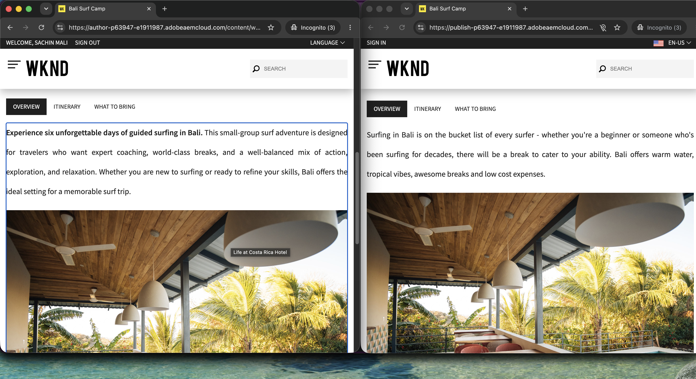
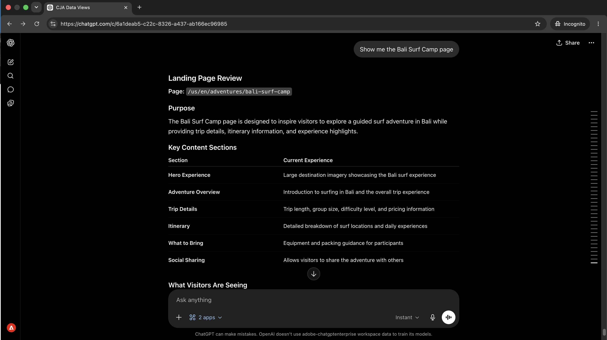

# Optimiser le contenu en fonction des données de performance
<!-- last-modified: 2026-06-08 -->



Pour boucler la boucle entre les données de performances de campagne et les mises à jour de contenu, basculez normalement entre votre outil d’analyse et votre CMS. Cette présentation explique comment connecter Customer Journey Analytics et AEM dans la même session d’IA : faire apparaître les campagnes avec des écarts de conversion, diagnostiquer ce qui les génère, inspecter le contenu, obtenir des recommandations ciblées et appliquer les modifications sans quitter votre conversation.

| Détails du scénario | |
| --- | --- |
| Applications d’entreprise CX | [](https://experienceleague.adobe.com/en/docs/analytics-platform/using/cja-overview/cja-overview), [Adobe Experience Manager as a Cloud Service](https://experienceleague.adobe.com/fr/docs/experience-manager-cloud-service/content/overview/introduction) |
| Outils agentiques | [CX Enterprise MCP](../tools/mcp-servers.md#cx-enterprise-mcp-servers), [Serveur AEM Content MCP](https://experienceleague.adobe.com/en/docs/experience-manager-cloud-service/content/ai-in-aem/using-mcp-with-aem-as-a-cloud-service) |
| Audience | Responsables de campagne, stratèges de contenu, opérations marketing |
| Prérequis | Client d’IA compatible MCP, accès CJA, accès AEM as a Cloud Service |

Chaque étape affiche une invite représentative et un exemple de réponse de l’IA. La section **Plus que vous pouvez accomplir** suit pour une exploration supplémentaire au cours de la même session.


## Avant de commencer

>[!BEGINTABS]

>[!TAB Claude.ai]

Connectez les deux serveurs MCP en tant que connecteurs personnalisés. Ajoutez chacun séparément.

1. Accédez à **Paramètres > Intégrations** dans Claude.ai.
2. Sélectionnez **Ajouter un connecteur personnalisé**, saisissez une URL de serveur, puis sélectionnez **Se connecter**.
3. Connectez-vous avec votre Adobe ID, puis répétez l’opération pour le deuxième serveur.

| Serveur | Point d’entrée |
| --- | --- |
| MCP d’entreprise CX | `https://cx-enterprise.adobe.io/mcp` |
| Serveur AEM Content MCP | `https://mcp.adobeaemcloud.com/adobe/mcp/content` |

Configuration complète : [documentation des connecteurs personnalisés Claude.ai](https://support.claude.com/en/articles/11175166-get-started-with-custom-connectors-using-remote-mcp)

>[!TAB ChatGPT]

Connectez les deux serveurs MCP en mode Développeur ChatGPT (Pro, Plus, Business, Enterprise ou Education plan requis). Ajoutez chaque serveur séparément.

1. Activez le **mode Développeur** dans **Paramètres ChatGPT**.
2. Accédez à **Paramètres > Intégrations** et sélectionnez **Ajouter un connecteur personnalisé > Serveur MCP distant**.
3. Saisissez une URL de serveur, sélectionnez **Connexion** et connectez-vous avec votre Adobe ID.
4. Répétez l’opération pour le deuxième serveur.

| Serveur | Point d’entrée |
| --- | --- |
| MCP d’entreprise CX | `https://cx-enterprise.adobe.io/mcp` |
| Serveur AEM Content MCP | `https://mcp.adobeaemcloud.com/adobe/mcp/content` |

Configuration complète : [documentation MCP ChatGPT](https://developers.openai.com/api/docs/guides/tools-connectors-mcp)

>[!TAB Autres clients d’IA]

Utiliser Gemini, Microsoft Copilot, Cursor, Claude Code ou un autre environnement compatible avec MCP ? Connectez-vous aux deux serveurs MCP à l’aide des points d’entrée suivants :

| Serveur | Point d’entrée |
| --- | --- |
| MCP d’entreprise CX | `https://cx-enterprise.adobe.io/mcp` |
| Serveur AEM Content MCP | `https://mcp.adobeaemcloud.com/adobe/mcp/content` |

Instructions de configuration complètes pour tous les clients pris en charge : [Connexion à votre client IA](../tools/mcp-servers.md)

>[!ENDTABS]

>[!NOTE]
>
>Connectez-vous avec votre Adobe ID lorsque vous y êtes invité et sélectionnez l’organisation IMS liée à vos environnements CJA et AEM. Choisir la mauvaise organisation est la source la plus courante d’erreurs d’authentification.
>
>Lors de la première connexion, votre client d’IA peut vous demander de sélectionner une organisation IMS ou de spécifier un sandbox. Une fois ce contexte défini, le serveur MCP l’utilise pour le reste de la session.
>
>Certains outils vous demandent votre approbation avant de s’exécuter. Examinez la demande et approuvez ou refusez. Aucune action n’est entreprise sans votre confirmation.


## Étape 1 : Rechercher des campagnes avec un écart de conversion

Utilisez CJA pour afficher en surface les campagnes où le clic publicitaire est important, mais où le taux de conversion est faible. Ce modèle (intention élevée, remplissage faible) indique généralement un problème de contenu ou d’expérience sur la page de destination.

```
Which campaigns have strong click-through but low conversion in the last 30 days?
```

+++Voir un exemple de réponse


+++


## Étape 2 : diagnostiquer la cause première

Effectuez un suivi pour comprendre ce qui cause l’écart. Demandez si la liste déroulante est concentrée sur un type d’appareil, un segment d’audience ou une interaction de contenu spécifique.

```
What's causing the conversion drop-off, is it device, segment, or content?
```

+++Voir un exemple de réponse


+++


## Étape 3 : vérifier le contenu dans AEM

Une fois la campagne peu performante identifiée, extrayez la page de destination d’AEM au cours de la même session. Voir ce que dit actuellement la page est le point de départ pour comprendre ce qu’il faut changer.

```
Show me the Bali Surf Camp page.
```

+++Voir un exemple de réponse

Client 

+++


## Étape 4 : obtenir des recommandations ciblées

Demandez à votre client d’IA de connecter ce que les données ont affiché à ce qui se trouve sur la page. L’IA a besoin de plusieurs sources pour identifier les sections de contenu susceptibles d’entraîner cette baisse et les éléments à modifier.

```
Which content sections are underperforming, and what changes would you recommend?
```

+++Voir un exemple de réponse


+++


## Étape 5 : appliquer et réviser les modifications

Demandez à votre client d’IA de créer une version optimisée de la page en fonction des recommandations et de résumer ce qui a changé et pourquoi.

```
Create an optimized version of the Bali Surf Camp page and summarize the proposed changes.
```

+++Voir un exemple de réponse

Client 

+++


>[!CAUTION]
>
>Examinez le résumé complet des modifications proposées avant de confirmer. Le serveur AEM Content MCP écrira les modifications dans votre environnement AEM. Les pages restent à l’état publié jusqu’à ce que vous les republiiez explicitement.


## Ce que vous avez accompli

Vous avez connecté Customer Journey Analytics et AEM en une seule session d’IA et déplacé les données de campagne vers les modifications de contenu déployées sans changer d’outil. Vous avez identifié des campagnes avec des écarts de conversion, diagnostiqué la cause première, inspecté la page de destination, reçu des recommandations ciblées basées sur les données et le contenu et appliqué les modifications dans la même conversation. Cela permet de raccourcir la boucle des commentaires entre Analytics insight et le contenu publié, et de mettre à l’échelle un nombre illimité de pages peu performantes au cours de la même session.


## Plus de choses à accomplir

Lorsque CJA et AEM sont connectés au cours de la même session, vous pouvez couvrir l’ensemble du cycle, de l’identification des problèmes aux correctifs d’expédition. Développez un scénario ci-dessous pour afficher les invites que vous pouvez essayer.

+++Recherche du contenu qui freine les performances

Un trafic élevé avec un faible engagement signale un problème de contenu, pas un problème de trafic. Ces invites vous aident à faire apparaître des pages et des modèles spécifiques qui nécessitent une attention particulière avant qu&#39;une échéance de campagne ne force le problème.

**Invites**

```
Which campaigns have the highest traffic but lowest conversion rate this quarter?
```

```
Which pages have a high bounce rate but also high traffic?
```

```
Compare engagement rates for landing pages across email and paid social campaigns.
```

```
Find AEM pages linked from active campaigns that haven't been updated in over 60 days.
```

+++

+++Correction de ce que les données vous indiquent de corriger

Une fois que vous savez ce qui est peu performant, effectuez des modifications ciblées en fonction de ce que les données de performance ont révélé. Ces invites permettent de mettre à jour des sections spécifiques en fonction du diagnostic.

**Invites**

```
Update the CTA on the [page name] page to better match the campaign audience.
```

```
Rewrite the hero headline on the [page name] page to address the mobile drop-off.
```

```
Add a trust signal to the [page name] page above the conversion form.
```

```
Which pages updated in this session still need to be published?
```

+++

+++Améliorations des expéditions avant la prochaine campagne

Les modifications apportées en milieu de session peuvent s’accumuler rapidement. Ces invites vous aident à vérifier ce qui est prêt, à regrouper les mises à jour pour révision et à effectuer une promotion propre avant qu’une campagne ne soit activée.

**Invites**

```
Show me all pages updated in this session that are still unpublished.
```

```
Create a launch with all changes from this session for review before publishing.
```

```
Give me a summary of all changes made in this session.
```

```
Publish all confirmed changes and share the updated URLs.
```

+++


## Informations supplémentaires

| Ressource | Ce que vous trouverez |
| --- | --- |
| [Serveur CJA MCP dans le registre IA](https://developer.adobe.com/ai-registry/#/mcp/cja-mcp){target="_blank"} | Disponibilité et outils du serveur CJA MCP |
| [Serveur AEM Content MCP dans le registre AI](https://developer.adobe.com/ai-registry/#/mcp/aem-content-mcp){target="_blank"} | Disponibilité et outils du serveur AEM Content MCP |
